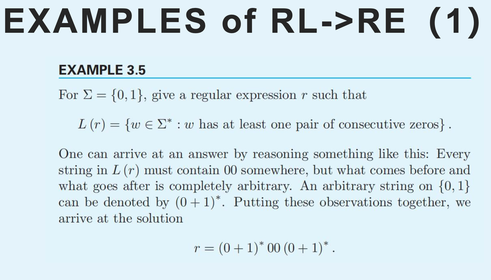
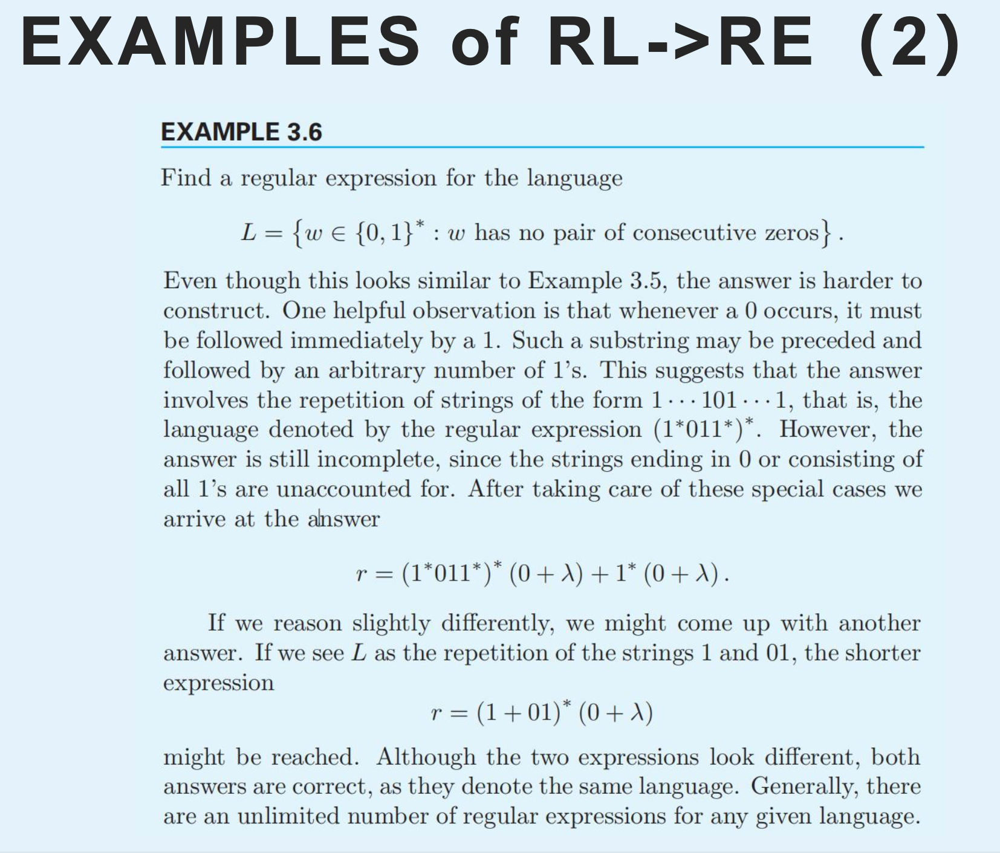

# Automata_note
 BUPTans, study_note

## 3.DFA

#### Concept

>Transition function

   

> Transition Table

> Example

#### 🌟**PPT**🌟

## 4.NFA

#### Concept

>Example

## 5.Minimal NFA

#### 🌟作业题🌟

## 6.RE

#### Concept

#### Example

##### RE->RL

##### RL->RE

##### RE->NFA

##### AF->RE 看ppt！！！🌟

## 7.RG

#### 定义

## 8. property of RL

### **CLOSURE PROPERTIES** 

#### union

####  intersection

#### concatenation

#### star- closure

#### complementation

#### difference

#### reversal

#### homomorphism

#### right quitient

### pumping lemma 🌟🌟

## 9. cfl

## 11. cfg simplification

## 12.cnf & gnf &CYK

### 1.CNF

==Chomsky Normal Form==

> The string on the right of a production consist of **no more**
> **than two symbols.**

1. simelify
2. terminal sign 
3. two to one

### 2.GNF

==Greibach Normal Form==

>A context-free grammar is said to be in Greibach normal form if all productions have the form
>
>**A->aX**,

### 3.CYK

## 13.PDA

### difine

# 单词

prime number

composite number
