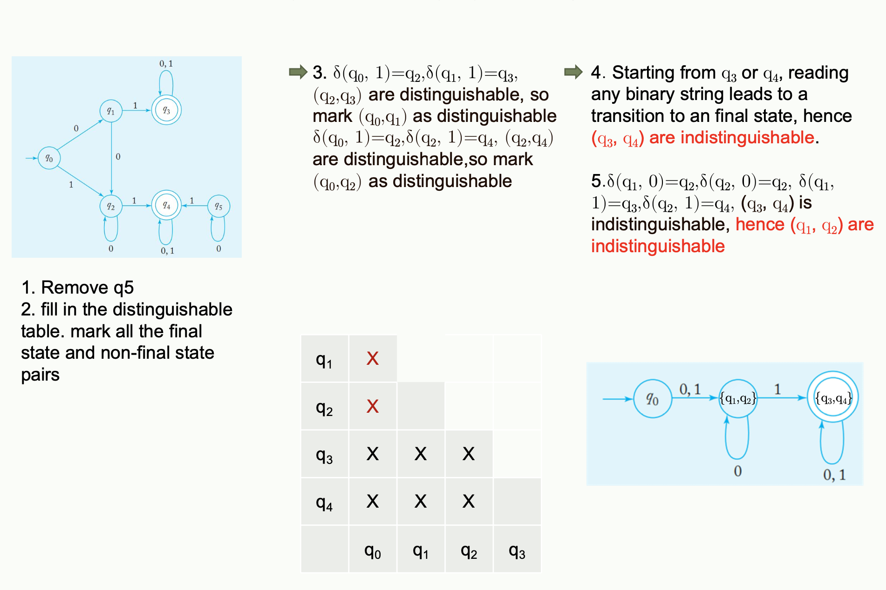

# Automata_note
 BUPTans, study_note

## 3.DFA

#### Concept

>Transition function

   

> Transition Table

> Example

#### 🌟**PPT**🌟

## 4.NFA

#### Concept

>Example

## 5.Minimal NFA

#### 🌟作业题🌟

## 6.RE

#### Example

